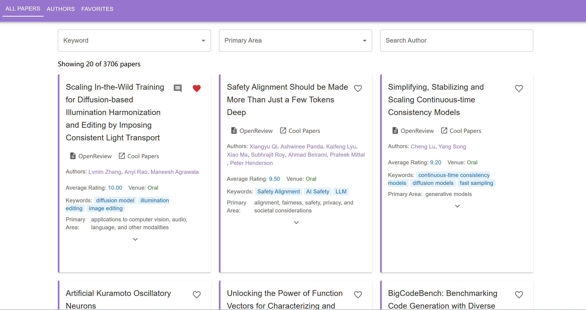

# ICLR 2025 Papers Explorer

A web application for exploring papers and preparing for a specific conference (ICLR 2025 in this case). You can use this to browse through all the papers in the conference, filter them by various criteria, and mark your favaorite papers and authors for easy access later.
Built with React, TypeScript, and Material-UI.




## Features

- **Browse Papers**: View all ICLR 2025 papers with filtering and sorting options
- **Author Exploration**: Discover authors and their publications
- **Favorites System**: Save your favorite papers and authors
- **Personal Notes**: Add comments, ratings, and status tracking to papers
- **Author Notes**: Add comments to your favorite authors
- **Paper Details**: View abstracts, keywords, ratings, and more
- **External Links**: Direct access to OpenReview and papers.cool for each paper

## Getting Started

### Prerequisites

- Node.js (v14 or later)
- npm

Visit the [official Node.js website](https://nodejs.org/) to download and install Node.js. You can verify the installation by running `node -v` and `npm -v` in your terminal.

### Installation

1. Clone the repository:
   ```bash
   git clone git@github.com:lijinhan21/Conference-Papers-Explorer.git
   cd Conference-Papers-Explorer/iclr-papers
   ```

2. Install dependencies:
   ```bash
   npm install
   ```

3. Start the development server:
   ```bash
   npm run dev
   ```

4. Open your browser and navigate to `http://localhost:5173`

Additionally, the script for using openreview api to fetch data is included in `conf_papers.py`. If you are interested, you can modify it to fetch data for other conferences or years.

## Usage

### Browsing Papers

- The home page displays all papers with pagination
- Use the search bar to filter papers by title, author, or keywords
- Click on a paper title to view its details
- Click on author names to see their other publications

### Managing Favorites

- Click the heart icon to add a paper or author to your favorites
- Access your favorites from the "Favorites" tab
- Add personal notes, ratings, and status (TODO/Done) to your favorite papers
- Add comments to your favorite authors

### External Resources

- Each paper has links to its OpenReview page and papers.cool summary
- Click on the icons next to the paper title to access these resources

## Data Storage

All user data (favorites, comments, ratings) is stored in your browser's local storage. This means:
- Your data persists between sessions
- Your data is private to your browser
- Clearing browser data will reset your favorites and notes

## Technologies Used

- **React**: UI library
- **TypeScript**: Type-safe JavaScript
- **Material-UI**: Component library
- **Vite**: Build tool and development server
- **React Router**: Navigation and routing

## Contributing

Contributions are welcome! Please feel free to submit a Pull Request.

1. Fork the repository
2. Create your feature branch (`git checkout -b feature/amazing-feature`)
3. Commit your changes (`git commit -m 'Add some amazing feature'`)
4. Push to the branch (`git push origin feature/amazing-feature`)
5. Open a Pull Request

## License

This project is licensed under the MIT License - see the LICENSE file for details.

## Acknowledgments

- ICLR 2025 for providing the conference data
- OpenReview for paper information
- papers.cool for paper summaries
- Cursor for developing the majority of this project

---

Built with ❤️ for the machine learning research community.
